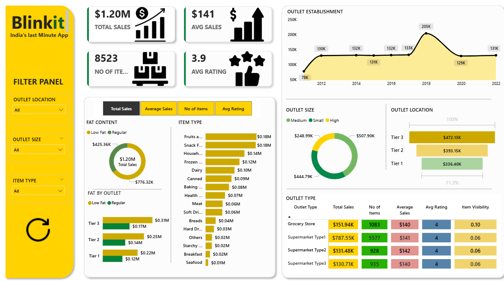

````md
# Blinkit Sales Analysis Dashboard | Power BI

## Project Overview
This project is an interactive retail sales analysis dashboard developed using Power BI based on the Blinkit grocery dataset. The dashboard helps analyze sales performance, outlet performance, item categories, customer ratings, and business trends through interactive visualizations and KPIs.

---

## Objective
The main objective of this project is to:
- Analyze retail sales performance
- Identify top-performing outlets and product categories
- Generate business insights for decision-making
- Build an interactive and user-friendly dashboard

---

## Tools & Technologies Used
- Power BI
- Power Query
- DAX (Data Analysis Expressions)
- Excel

---

## Dataset Information
The dataset contains grocery sales-related information including:
- Item Type
- Item Fat Content
- Outlet Type
- Outlet Size
- Outlet Location
- Sales
- Ratings
- Item Visibility
- Outlet Establishment Year

Total Records: 8523

---

## Data Cleaning & Transformation
Performed the following data preprocessing steps:
- Checked and handled missing values
- Corrected data types
- Removed inconsistencies
- Cleaned categorical values
- Performed data transformation using Power Query

---

## DAX Measures Used
Some important DAX measures used in this project:

```DAX
Total Sales = SUM('BlinkIT Grocery Data'[Sales])

Average Sales = AVERAGE('BlinkIT Grocery Data'[Sales])

Number of Items = COUNT('BlinkIT Grocery Data'[Item Identifier])

Average Rating = AVERAGE('BlinkIT Grocery Data'[Rating])
```

---

## Dashboard Features
- KPI Cards
  - Total Sales
  - Average Sales
  - Number of Items
  - Average Rating

- Interactive Slicers
  - Outlet Location
  - Outlet Size
  - Item Type

- Visualizations
  - Donut Charts
  - Bar Charts
  - Line/Area Charts
  - Matrix Tables

---

## Business Insights
- Tier 3 outlets generated the highest sales
- Supermarket Type 1 showed the best overall performance
- Fruits and Snacks category contributed the highest revenue
- Regular fat products had higher sales contribution

---

## Key Learnings
Through this project, I learned:
- Data cleaning and preprocessing
- DAX calculations and measures
- Data visualization techniques
- Dashboard designing in Power BI
- Business insight generation

---

## Dashboard Screenshot

Example:



---

## Future Improvements
- Add more advanced DAX calculations
- Implement drill-through analysis
- Connect with live data sources
- Add forecasting and trend prediction

---

## Author
Vikram Roy

LinkedIn: www.linkedin.com/in/royvikram


````
